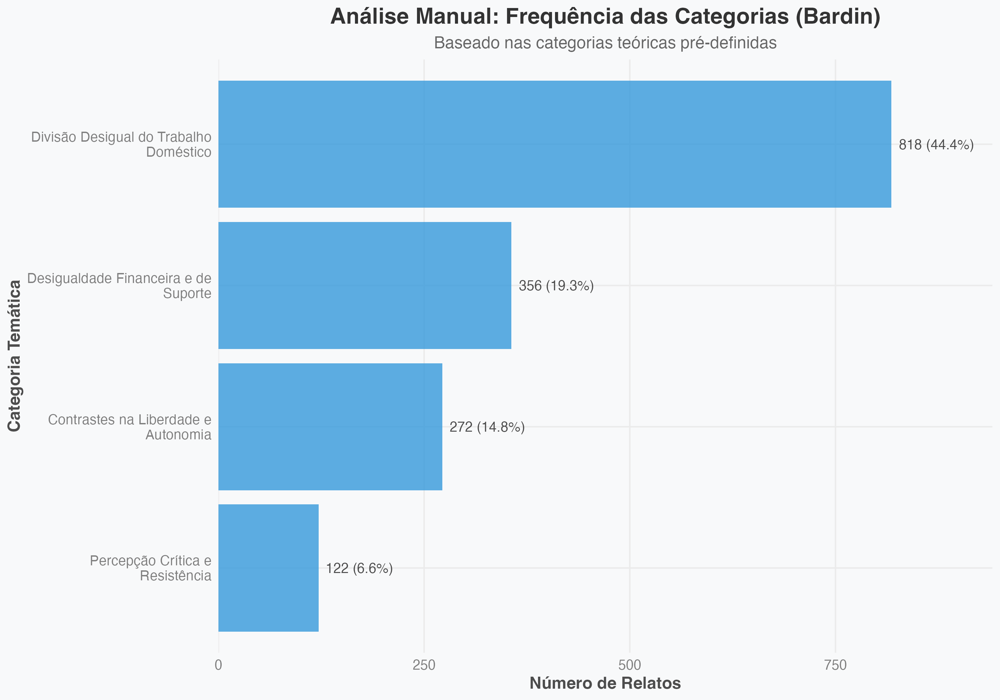
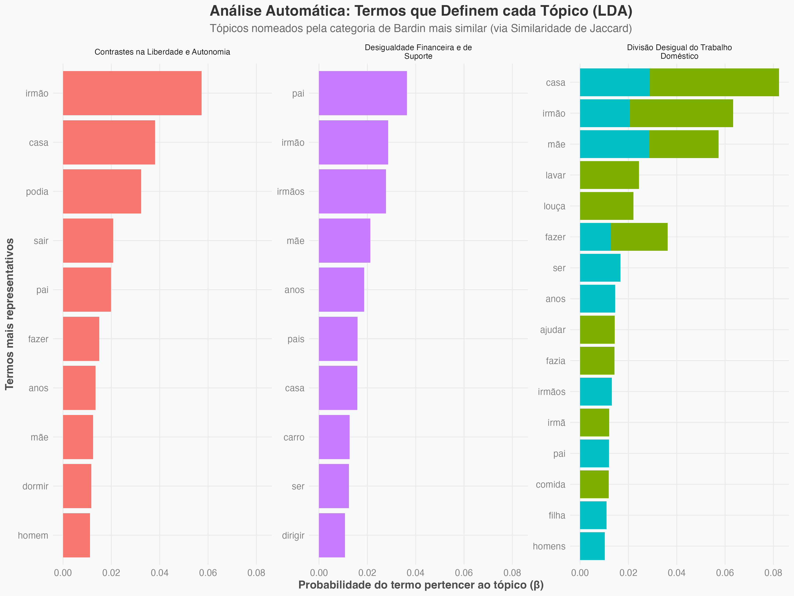
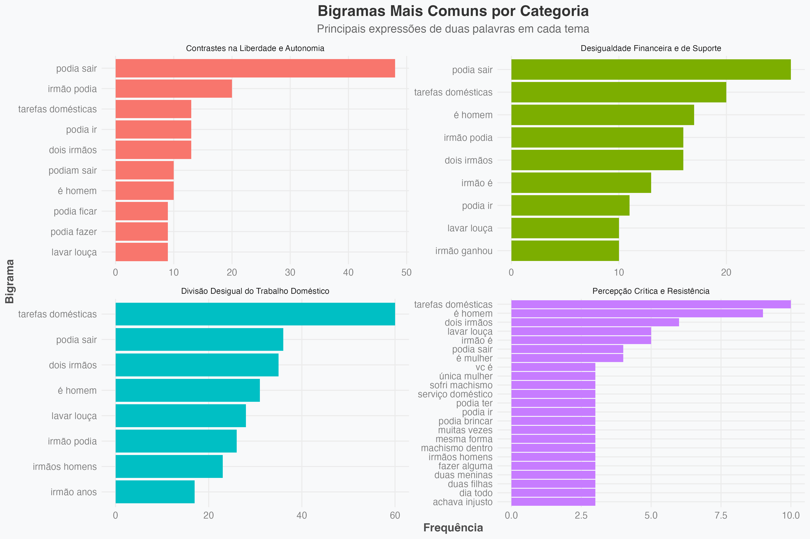
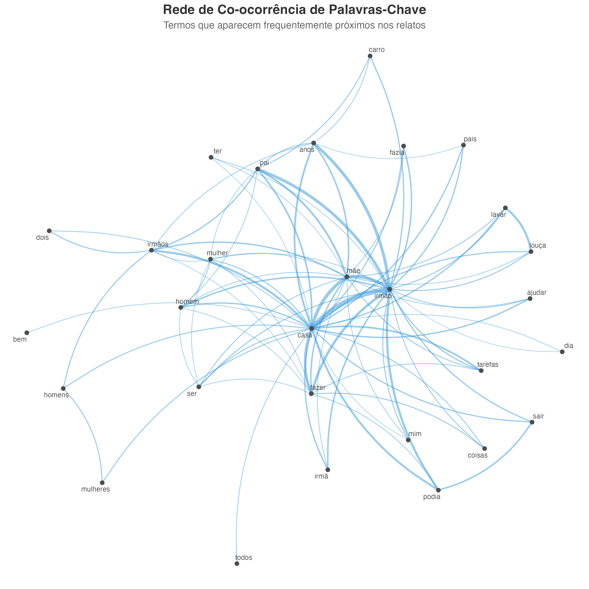
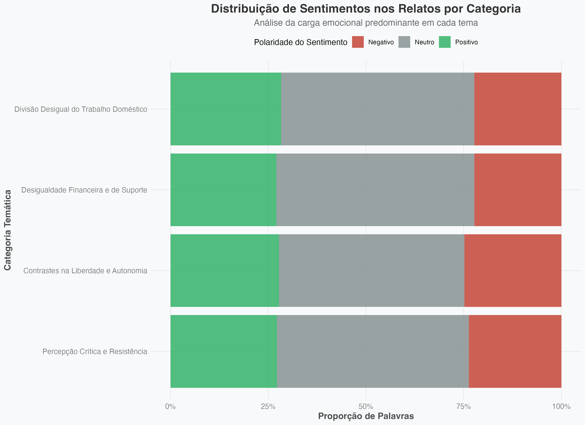
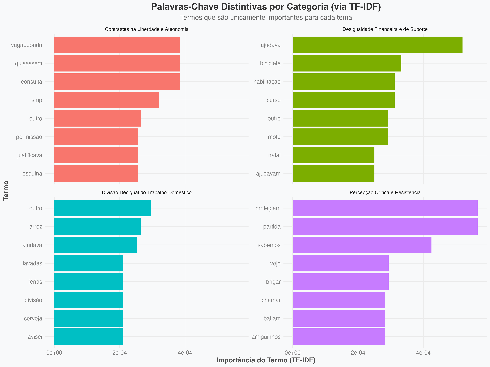

# “Costume de Casa Vai à Praça”: A Reprodução de Estereótipos e do Sexismo no Cotidiano Familiar

Este repositório contém todos os dados, scripts e artefactos gerados para o Trabalho de Conclusão de Curso (TCC) de Heloisa Diniz Ferreira, apresentado ao curso de Graduação em Psicologia da Universidade Federal de Campina Grande (UFCG).

O objetivo da pesquisa foi analisar os sentidos atribuídos por mulheres às experiências de preterição e desigualdade de género vividas na infância e adolescência no ambiente familiar, utilizando uma abordagem híbrida que combina análise de conteúdo qualitativa com técnicas de processamento de linguagem natural.

---

## Estrutura do Repositório

O projeto está organizado da seguinte forma:

-   `/html/`: Contém o ficheiro HTML bruto da página do Instagram de onde os comentários foram extraídos.
-   `/images/`: Imagens auxiliares utilizadas para documentar o processo de coleta.
-   `/resultados/`: Contém os dados brutos dos comentários coletados nos formatos `.csv`, `.json` e `.tsv`.
-   `/rproject/`: Contém o projeto R completo com o script de análise e todos os resultados gerados.
    -   `bardin_analysis.R`: O script R oficial e comentado que realiza toda a análise de dados.
    -   `/rproject/resultados/`: Pasta onde todos os artefactos da análise R são guardados.
        -   `/graficos/`: Contém todas as imagens dos gráficos gerados.
        -   Ficheiros `.csv` com os dados processados (frequências, exemplos, etc.).
-   `/scripts/`: Contém os scripts JavaScript utilizados no processo de coleta de dados.
-   `script.js`: Script principal em JavaScript para extrair os comentários do ficheiro HTML.
-   `index.html`: Página de apresentação do projeto para o GitHub Pages.
-   `README.md`: Este ficheiro.

---

## Metodologia

### Coleta de Dados

A coleta dos comentários foi realizada de forma semi-manual para evitar bloqueios da plataforma Instagram, seguindo os passos abaixo:

1.  **Scroll Manual:** Foi feito scroll na página com os comentários até ao final, garantindo que todos os comentários visíveis fossem carregados pelo navegador.
2.  **Expansão dos Comentários:** Um script (`/scripts/browser_click_more.js`), executado na consola do navegador, foi utilizado para clicar programaticamente em todos os botões "ver mais", garantindo que o conteúdo completo de comentários longos fosse carregado.
3.  **Cópia do HTML:** O código-fonte completo da página, já com todos os comentários carregados e expandidos, foi copiado e salvo no ficheiro `/html/html-comentarios.html`.
4.  **Extração dos Dados:** O script principal (`script.js`) foi executado para percorrer o ficheiro HTML salvo, extrair o texto de cada comentário, nome de utilizador e número de curtidas, e organizar os dados em ficheiros estruturados (`.csv`, `.tsv`, `.json`).
5.  **Observação Importante:** Os seletores de classe utilizados no `script.js` (ex: `.xurb0ha`) são específicos da versão do Instagram no momento da coleta. futuras atualizações na estrutura do site podem exigir a modificação destes seletores.

### Tratamento e Análise dos Dados

A análise foi conduzida utilizando o script `rproject/bardin_analysis.R`, que implementa uma abordagem híbrida:

1.  **Critérios de Inclusão e Exclusão:** Para a construção do corpus final, foram mantidos apenas comentários com mais de 15 caracteres e que continham palavras-chave relevantes ao contexto familiar (ex: "irmão", "pai", "casa"). Este processo resultou num corpus final de **1.215 comentários**.

2.  **Análise de Conteúdo (Bardin):** Com base no referencial teórico, foram definidas quatro categorias temáticas a priori. O script classificou cada comentário relevante dentro destas categorias com base num dicionário de palavras-chave.

3.  **Modelagem de Tópicos (LDA):** Como forma de validação, foi utilizada a técnica Latent Dirichlet Allocation (LDA) para identificar os temas que emergem estatisticamente do corpus. O modelo foi configurado para encontrar 4 tópicos, permitindo uma comparação direta com as categorias de Bardin.

4.  **Análises Complementares:** O script também gera análises de bigramas (expressões de duas palavras), análise de sentimentos, TF-IDF (termos mais distintivos), redes de co-ocorrência e extrai exemplos representativos para cada categoria.

### Como Reproduzir a Análise

1.  Clone este repositório.
2.  Certifique-se de que tem o R e o RStudio instalados.
3.  Abra o ficheiro `rproject/rproject.Rproj` no RStudio.
4.  No RStudio, instale os pacotes necessários executando o seguinte comando na consola:
    ```R
    install.packages(c("tidyverse", "tidytext", "quanteda", "quanteda.textplots", "topicmodels", "wordcloud2", "ggraph", "igraph", "ggrepel", "lexiconPT"))
    ```
5.  Execute o script `bardin_analysis.R` na íntegra.
6.  Todos os resultados, incluindo gráficos e tabelas de dados, serão gerados e guardados na pasta `/rproject/resultados/`.

---

## Resultados e Interpretação dos Gráficos

A seguir, uma interpretação dos principais artefactos visuais gerados pela análise.

### Gráfico 1: Frequência das Categorias (Bardin)

**Interpretação:** Este gráfico mostra a prevalência de cada tema definido manualmente. A "Divisão Desigual do Trabalho Doméstico" é, de longe, a experiência mais relatada (44.4%), estabelecendo-se como o núcleo da desigualdade percebida pelas participantes.

### Gráfico 9: Validação Metodológica (Bardin vs. LDA)

**Interpretação:** Este é o gráfico central da análise híbrida. Ele compara as contagens da análise manual (azul) com a automática (vermelho). A forte correspondência nas três primeiras categorias valida a robustez dos temas. Notavelmente, o LDA não conseguiu isolar um tópico para "Percepção Crítica e Resistência", indicando que, embora real, este tema possui um vocabulário estatisticamente mais difuso, o que realça o valor da análise qualitativa para capturar tais nuances.

### Gráfico 2: Termos que Definem cada Tópico (LDA)

**Interpretação:** Este gráfico mostra as palavras que o algoritmo LDA considerou mais importantes para cada tópico. A coerência é notável: o tópico mapeado para "Trabalho Doméstico" contém termos como `casa`, `lavar`, `louça`, `fazer`, validando a correspondência semântica com a categoria de Bardin.

### Gráfico 4: Bigramas Mais Comuns por Categoria

**Interpretação:** A análise de bigramas revela as expressões que dão contexto aos temas. Expressões como "podia sair" (Liberdade), "tarefas domésticas" (Trabalho Doméstico) e "irmão ganhou" (Financeiro) são micro-narrativas que exemplificam vividamente a essência de cada categoria.

### Gráfico 6: Rede de Co-ocorrência de Palavras-Chave

**Interpretação:** A rede mostra as conexões entre as palavras mais relevantes. `Irmão`, `mãe` e `casa` são os nós centrais do discurso. A figura do "irmão" atua como uma ponte que conecta quase todos os outros conceitos, reforçando o seu papel como principal figura de comparação na percepção da desigualdade.

### Gráfico 10: Distribuição de Sentimentos por Categoria

**Interpretação:** Este gráfico revela que os relatos, embora descrevam experiências dolorosas, são narrados predominantemente com uma linguagem neutra e factual, em vez de um vocabulário carregado de emoção negativa. Isso sugere uma descrição sóbria e objetiva das desigualdades vividas.

### Gráfico 11: Palavras-Chave Distintivas (TF-IDF)

**Interpretação:** O TF-IDF destaca palavras que são unicamente importantes para uma categoria. Termos como `bicicleta` e `curso` para "Financeira", ou `permissão` para "Liberdade", mostram a especificidade do vocabulário de cada tema, reforçando a validade da separação das categorias.

---

**Autora:** Heloisa Diniz Ferreira
